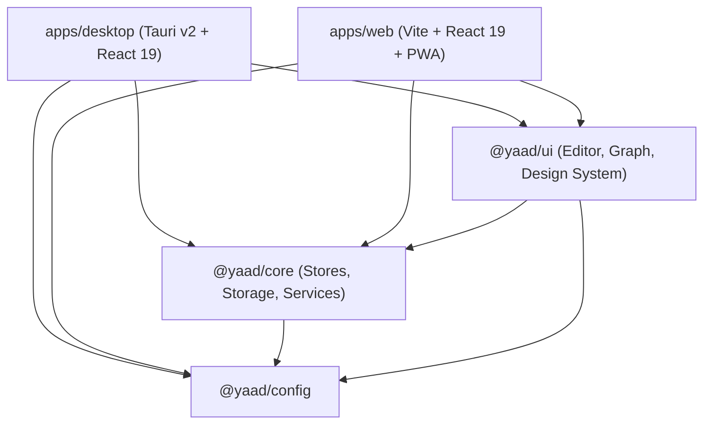

# Yaad Technical Architecture

This document describes the high-level architecture, design patterns, and subsystem implementations of Yaad.

---

## 1. System Overview

Yaad is a modular, local-first personal knowledge management (PKM) platform structured as a pnpm monorepo:



- **Clean Layer Separation**: Pure business logic, types, and persistence reside strictly within `@yaad/core`. No DOM, React, or browser-specific rendering elements exist in `core`.
- **Reusable Presentation Layer**: `@yaad/ui` handles rendering, rich text editing, drag-and-drop canvas logic, graph visualization, and theme tokens.
- **Thin Shell Applications**: Both `apps/desktop` and `apps/web` act as thin application shells configuring routing and bootstrapping platform-specific capabilities (e.g. Tauri native window/SQL plugins vs Web PWA workers).

---

## 2. Storage Subsystem

Yaad's persistence layer is strictly local-first and environment-adaptive.

### Dual-Driver Storage Pattern

Persistence implementations satisfy the [`StorageAdapter`](file:///d:/CODE/CODE/yaad/packages/core/src/lib/storage/types.ts) interface:

```typescript
export interface StorageAdapter {
  init(): Promise<void>;
  getWorkspace(): Promise<WorkspaceMetadata | null>;
  saveWorkspace(workspace: WorkspaceMetadata): Promise<void>;
  getPage(pageId: string): Promise<DocumentJSON | null>;
  savePage(page: DocumentJSON): Promise<void>;
  deletePage(pageId: string): Promise<void>;
  getPageTree(): Promise<SidebarNode[]>;
  savePageTree(tree: SidebarNode[]): Promise<void>;
  getTrash(): Promise<TrashItem[]>;
  saveTrash(trash: TrashItem[]): Promise<void>;
  // Optional tag indexing methods
  saveDocTags?(pageId: string, tags: Tag[]): Promise<void>;
  deleteDocTags?(pageId: string): Promise<void>;
  getTagsIndex?(): Promise<Tag[]>;
}
```

### Dynamic Proxy Dispatch

[`storage-provider.ts`](file:///d:/CODE/CODE/yaad/packages/core/src/lib/storage/storage-provider.ts) exposes a single unified `storage` export wrapped in a dynamic JavaScript `Proxy`:

```typescript
export const storage: StorageAdapter = new Proxy({} as StorageAdapter, {
  get(_target, prop: keyof StorageAdapter) {
    const adapter = getStorageAdapter();
    const value = adapter[prop];
    return typeof value === "function" ? value.bind(adapter) : value;
  },
});
```

- **Tauri Environment**: Detects `__TAURI_INTERNALS__` or `__TAURI__` on `window` and delegates to [`TauriSqlAdapter`](file:///d:/CODE/CODE/yaad/packages/core/src/lib/storage/tauri-sql-adapter.ts), writing to a local SQLite database with normalized tables (`documents`, `workspaces`, `sidebar_nodes`, `trash_items`, `tags`).
- **Browser / PWA Environment**: Delegates to [`LocalJsonAdapter`](file:///d:/CODE/CODE/yaad/packages/core/src/lib/storage/local-json-adapter.ts), storing JSON payloads safely in IndexedDB using `idb-keyval`.

---

## 3. State Management & Lifecycle

Yaad utilizes [Zustand](https://github.com/pmndrs/zustand) for reactive state management, segregated into focused stores and slices.

### Store Architecture

1. **`useWorkspaceStore`**: Manages active workspaces, workspace switching, and workspace settings.
2. **`useSidebarStore`**: Slices `pages-slice.ts` (page tree hierarchy, creation, renaming, tree reordering) and `ui-slice.ts` (sidebar collapse, widths, active views).
3. **`useTabStore`**: Tracks navigation tabs (order, active tab, history, close tab routines).
4. **`useTagStore`**: Manages tag taxonomy, tag colors, and document tag associations.
5. **`useDocumentStore(pageId)`**: Factory returning an isolated, memoized store instance per document.

### Per-Document Store Factory & Memory Eviction

To prevent race conditions and cross-document state bleeding, each open document has an independent store instance managed via a store registry in `use-document-store.ts`.

#### Memory Leak Prevention
When tabs are closed (`closeTab`, `closeOtherTabs`, `closeTabsToRight`, `closeAllTabs`, or switching workspaces), [`useTabStore`](file:///d:/CODE/CODE/yaad/packages/core/src/store/use-tab-store.ts) automatically triggers:

```typescript
removeDocumentStore(pageId);
```

This clears the document store from the module-level registry and releases memory associated with large block trees, undo stacks, and editor state.

---

## 4. Block Editor Engine

The editor is a modular, block-oriented canvas.

### Data Model

Each document is structured as a flat dictionary of blocks with hierarchical parent-child relationships:

```typescript
export interface DocumentBlock {
  id: string;                      // blk_<nanoid>
  type: DocumentBlockType;         // "paragraph", "heading_1", "todo", etc.
  parentId: string | null;         // Parent block ID or null for root
  childrenIds: string[];           // Ordered array of child block IDs
  properties: Record<string, any>; // Block-specific payload (text, checked, language, etc.)
  format?: Record<string, any>;    // Visual formatting (align, bgColor, etc.)
  tags?: Tag[];                    // Block-level tags
  createdAt: number;
  updatedAt: number;
}
```

### `useEditableBlock` Hook

Common block behaviors (focus management, cursor position, Enter to split, Backspace to delete/convert, slash menu activation, and text updates) are encapsulated in [`useEditableBlock`](file:///d:/CODE/CODE/yaad/packages/ui/src/hooks/editor/use-editable-block.ts). Individual block components (`TextBlock`, `TodoBlock`, `BulletListBlock`, `QuoteBlock`) remain clean and declarative.

### Supported Block Types

- **Typography**: `paragraph`, `heading_1`, `heading_2`, `heading_3`, `bulleted_list`, `quote`
- **Interactive**: `todo` (with checkbox completion), `table` (grid editing), `kanban` (drag-and-drop card columns)
- **Developer / Technical**: `code` (with syntax highlighting)
- **Media & Links**: `image`, `link_preview` (with metadata scraping), `page` (nested subpage links)
- **Structural**: `separator` (divider line), `column_list`
- **Callouts**: `callout` with icon picker and accent styling

---

## 5. Centralized ID Conventions

All system entities use strongly-typed, prefixed identifiers generated via [`packages/core/src/lib/id.ts`](file:///d:/CODE/CODE/yaad/packages/core/src/lib/id.ts):

| Entity | Prefix Format | Generator Function | Example |
|---|---|---|---|
| Page | `page_<nanoid>` | `generatePageId()` | `page_V1StGXR8_Z` |
| Block | `blk_<nanoid>` | `generateBlockId()` | `blk_u47f8B-9L` |
| Workspace | `ws_<nanoid>` | `generateWorkspaceId()` | `ws_9m18Zpx0` |
| Kanban Card | `crd_<nanoid>` | `generateCardId()` | `crd_k87a1F0z` |

This standard eliminates ambiguity across URLs, tree nodes, block parent pointers, and database foreign keys.

---

## 6. Knowledge Graph Visualization

The interactive knowledge graph (`GraphPage` in `@yaad/ui`) is implemented using `@xyflow/react` coupled with a `d3-force` simulation:
- **Global View**: Renders all pages in the current workspace as nodes and cross-page links as directed edges.
- **Local View**: Scopes the graph to a single target `pageId` and its immediate 1st and 2nd-degree neighbors.
- **Node Interaction**: Clicking a node navigates immediately to `/workspace/:workspaceId/:pageId`.

---

## 7. Routing & Layout Structure

Yaad utilizes React Router v8:

```
/                                    -> LandingPage
/landing                             -> Redirects to /
/app                                 -> HomePage (Workspace selector & onboarding)
/workspace/:workspaceId              -> WorkspaceHomePage
/workspace/:workspaceId/graph        -> Workspace-wide Knowledge Graph
/workspace/:workspaceId/trash        -> Workspace Trash & Recovery
/workspace/:workspaceId/:pageId      -> EditorShell (Page editor)
/workspace/:workspaceId/:pageId/graph-> Scoped Local Page Knowledge Graph
```

All workspace routes are wrapped within `MainLayout`, which hosts the collapsible sidebar, navigation tabs header, and global search command palette (`Cmd/Ctrl + K`).
